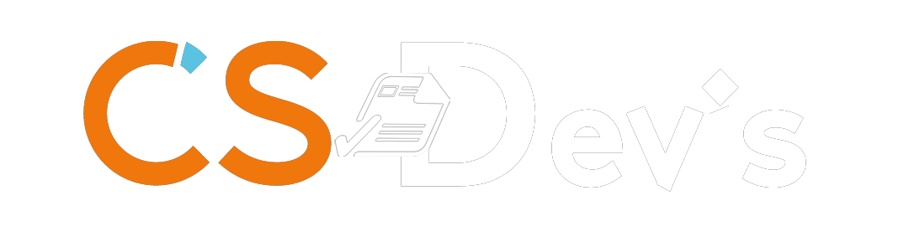

# Description
The quotation generator is a solution designed to enable Cloud Steroids to improve its responsiveness and sales performance.
It comprises 3 components:
-Customer interface, which is the platform used to generate data
-Administrator interface, which enables configuration of the client interface
-and the API enabling the two applications to communicate with each other.

| Directory | Object | 
| ------------- | ---------------- 
| **Styles**      | *Contains CSS files (header.css, footer.css, common.css)*.      |
| **Images**      | *Contains images appearing on the site*      |
| **AUTHORS**      | *List of project participants *      |

